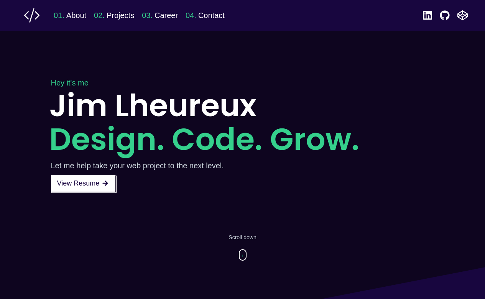

  

<a href="https://jimcv.me/" target="_blank">Check it out</a>

<h1 align="center">
  My Gatsby Portfolio 
</h1>

<h4>
  This website was created using the <a href=https://github.com/Knochenmark/gatsby-starter-level-2" target="_blank">Gatsby Starter Level 2</a> as the base theme.
</h4>

Developed as way to explore the Gatsby platform and assess it's potential use for upcoming projects. 

Since I primarily develop on the WordPress platform, my day-to-day tech stack primarily focuses on HTML and CSS (with some PHP and JavaScript).  

As a developer, I am in a constant state of digital growth and always looking for new technologies to integrate into my aresenal.  With the popularity of React exploding recently, it made sense to try learning more.  

Unfortunately, basic online tutorial and videos become quite boring for me after the first 10 minutes. I'd rather build something useful and learn at the same time.  
Enter Gatsby.

Gatsby is an open-source static website generator (SSG) that is based on the frontend development framework React and makes use of Webpack and GraphQL technology. It can be used to build static sites that are progressive web apps, follow the latest web standards, and optimized for speed and security.

The base developer experience using Gatsby is worlds different than WordPress.  There is quite a learning curve and it took a little while to wrap my head around the structure and how everything connects and interacts with each other. It was fun change using Markdown files for content and then styling through JavaScript and Stylus CSS. 

After completing this project, it's easy to see how this could be used to quickly develop fast-loading responsive websites.  I think I'll definitely be using Gatsby again in the future.

---
## Base Features I'm Using

- Responsive Layout
- High configurability
- Configurable Sections via Markdown
  - Hero
  - About
  - Featured Projects
  - Contact
- Social Links
- Styled Components with Emotion

## Features I've Added

- New Color Theme
- Sticky NavBar
- Career Section
- Education Section
- Increased Number of Featured Projects on Page
- Education Section
- Integrated Contact form (GetForm.io)

