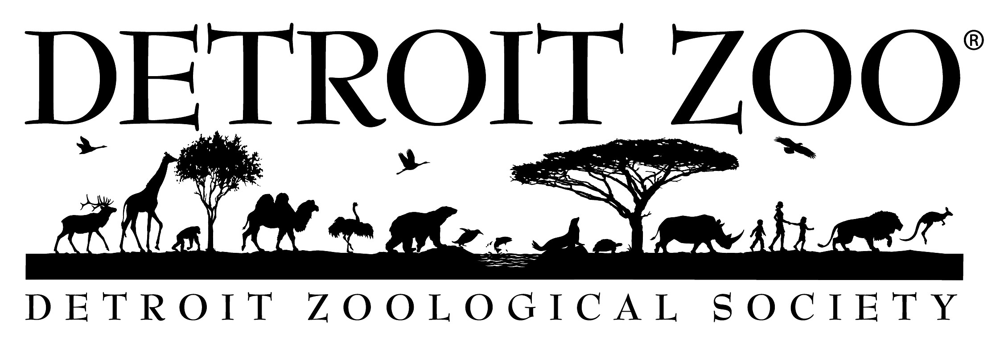

<!--  -->
I currently lead development and site administration for 10+ web properties built primarily on WordPress through the WP-Engine multisite platform. My day-to-day role involves working with multiple departments to update and develop new content to further advance the Detroit Zoological Society's mission by providing visitors with a accessible and responsive online experience. 

### Highlights
Lead website migration project converting a drupal 8 site to WordPress consolidating hosting and management resources resulting in a **$7,000** per year savings.

Spearheaded Google Analytics utilization campaign generating custom reports and presenting information to key stakeholders helping to shape marketing and content strategy increasing social media interactions and **raising email open rate by 6%**.

Lead initiative to implement structured data into key website to promote visibility across multiple Google services resulting in a **11% increase** in traffic to targeted pages.

Lead website backup project to consolidating files and services **reducing monthly AWS cost by 90%**

Lead Education Outreach project to create an online lesson section by integrating YouTube API, developing page content, & scheduling post providing an outlet for previously under-utilized media.

Integrated Hotjar analytics into site to provide a clear representation of visitor behavior helping to develop an UI/UX improvement strategy. 

Integrated chat assistant into website **reducing call center load by 30%** through configuring user paths and monitoring report metrics to shape response triggers.